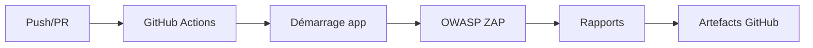

# DAST (Dynamic Application Security Testing)

## Introduction

Le DAST analyse une application **en fonctionnement** en interagissant avec ses endpoints HTTP comme le ferait un attaquant. Contrairement au SAST (code source), le DAST observe le comportement runtime.

Nous utilisons **OWASP ZAP** via GitHub Actions sur :
- `app-qg-api` (FastAPI)
- `app-qg-front` (Next.js)

---

## Pourquoi le DAST ?

| Aspect | Description |
|--------|-------------|
| **Runtime** | Détecte les vulnérabilités en conditions réelles (config HTTP, cookies, headers) |
| **Complémentaire au SAST** | Attrape les erreurs de configuration invisibles dans le code |
| **Headers de sécurité** | Vérifie CSP, X-Frame-Options, cookies Secure/HttpOnly |
| **Automatisé** | Scans à chaque push/PR + scans hebdomadaires |

---

## Pourquoi OWASP ZAP ?

- Outil de référence OWASP, aligné sur le **Top 10**
- Actions GitHub officielles (`zaproxy/action-api-scan`, `zaproxy/action-baseline`)
- Open-source et gratuit
- Règles personnalisables via `.zap/rules.tsv`

---

## Workflow



### Déclencheurs

| Événement | Quand |
|-----------|-------|
| `push` | Push sur `main` |
| `pull_request` | PR vers `main` |
| `schedule` | Mardi 3h UTC |
| `workflow_dispatch` | Manuel |

---

## Implémentation

### app-qg-api (FastAPI)

| Mode | Quand | Action |
|------|-------|--------|
| **API Scan** | push/PR | `zaproxy/action-api-scan` - rapide |
| **Full Scan** | schedule/manual | `zaproxy/action-full-scan` - complet |

```yaml
uses: zaproxy/action-api-scan@v0.9.0
with:
  target: "http://localhost:8000"
  rules_file_name: ".zap/rules.tsv"
```

### app-qg-front (Next.js)

| Mode | Quand | Action |
|------|-------|--------|
| **Baseline Scan** | push/PR | `zaproxy/action-baseline` - crawl passif |
| **Full Scan** | schedule/manual | `zaproxy/action-full-scan` - complet |

```yaml
uses: zaproxy/action-baseline@v0.15.0
with:
  target: "http://localhost:3000"
  rules_file_name: ".zap/rules.tsv"
```

---

## Configuration des règles

Fichier `.zap/rules.tsv` :

```text
rule_idACTIONdescription
```

| Action | Comportement |
|--------|--------------|
| `IGNORE` | Règle ignorée (faux positifs) |
| `WARN` | Alerte non bloquante |
| `FAIL` | Bloque le workflow |

**Politique** : échec si alertes de sévérité **HIGH** détectées.

---

## Complémentarité SAST / DAST

| Aspect | SAST | DAST |
|--------|------|------|
| **Cible** | Code source | Application en exécution |
| **Détecte** | Bugs dans le code | Erreurs de configuration |
| **Moment** | Build time | Runtime |

Les deux combinés réduisent fortement le risque de vulnérabilités en production.

---

## Ressources

- [OWASP ZAP](https://www.zaproxy.org/)
- [ZAP GitHub Actions](https://github.com/zaproxy/action-baseline)
