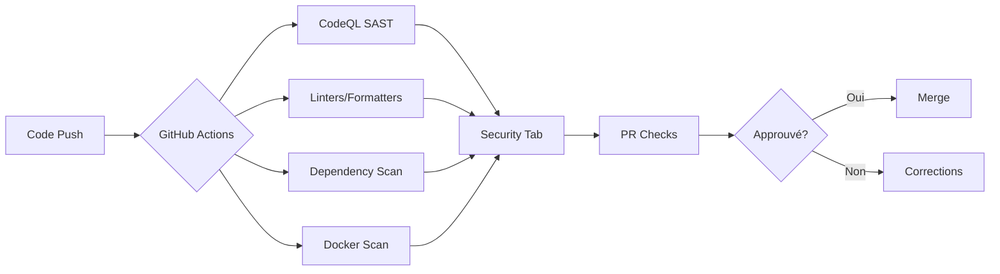

# SAST (Static Application Security Testing)

## Table des matières

1. [Introduction](#introduction)
2. [Intérêt du SAST](#intérêt-du-sast)
3. [Raisons du choix](#raisons-du-choix)
4. [Outils déployés](#outils-déployés)
5. [Implémentation par application](#implémentation-par-application)
6. [Configuration et bonnes pratiques](#configuration-et-bonnes-pratiques)

---

## Introduction

Le SAST (Static Application Security Testing) est une méthode d'analyse de sécurité qui examine le code source, le bytecode ou les binaires d'une application **sans l'exécuter**. Cette approche « white box » permet d'identifier les vulnérabilités de sécurité, les failles de qualité et les mauvaises pratiques dès les premières phases du développement.

Notre projet transversal implémente une stratégie SAST complète et automatisée via GitHub Actions, couvrant l'ensemble de notre stack technologique multi-langages.

---

## Intérêt du SAST

### 1. **Détection précoce des vulnérabilités** 🛡️

Le SAST permet d'identifier les failles de sécurité **avant la mise en production**, réduisant considérablement les coûts de correction. Selon l'IBM System Science Institute, corriger une vulnérabilité en production coûte **100 fois plus cher** qu'en phase de développement.

### 2. **Shift-Left Security** ⬅️

En intégrant la sécurité dès le début du cycle de développement (CI/CD), nous adoptons une approche « shift-left » qui :
- Responsabilise les développeurs sur la sécurité
- Réduit le temps de correction (feedback immédiat)
- Évite l'accumulation de dette technique de sécurité

### 3. **Conformité et standards** 📋

Notre SAST aide à respecter :
- **OWASP Top 10** : détection des vulnérabilités les plus critiques
- **CWE** (Common Weakness Enumeration) : identification des faiblesses logicielles
- **Standards de codage** : respect des bonnes pratiques par langage

### 4. **Couverture complète du code** 📊

Contrairement aux tests dynamiques (DAST), le SAST analyse **100% du code source**, y compris :
- Les chemins d'exécution rarement empruntés
- Les fonctionnalités non encore déployées
- Les branches de code mort

### 5. **Automatisation et intégration CI/CD** 🔄

L'analyse automatique à chaque commit/PR permet :
- Une surveillance continue de la qualité et sécurité
- Un blocage des PR en cas de vulnérabilités critiques
- Une traçabilité complète des problèmes détectés

---

## Raisons du choix

### Pourquoi CodeQL ?

**CodeQL** (GitHub Advanced Security) est notre outil principal de SAST pour plusieurs raisons :

#### ✅ **Avantages techniques**

1. **Analyse sémantique avancée**
   - CodeQL traite le code comme une base de données interrogeable
   - Détection de patterns complexes (data flow, taint analysis)
   - Faibles taux de faux positifs comparé aux outils de pattern matching

2. **Support multi-langages**
   - Python, JavaScript/TypeScript, Java nativement supportés
   - Queries personnalisables pour chaque langage
   - Évolution continue des règles de sécurité

3. **Intégration GitHub native**
   - Configuration simple via workflows GitHub Actions
   - Résultats directement dans les Pull Requests
   - GitHub Security Advisories automatiques

4. **Queries `security-and-quality`**
   - Nous utilisons le pack de requêtes étendu (`+security-and-quality`)
   - Couvre OWASP Top 10, CWE, et best practices
   - Plus de 200 règles par langage

#### ✅ **Avantages organisationnels**

- **Gratuit pour les dépôts publics** : économie de licence
- **Communauté active** : queries partagées et mises à jour fréquentes
- **Formation** : documentation extensive et exemples

### Outils complémentaires choisis

| Outil | Usage | Raison du choix |
|-------|-------|-----------------|
| **Ruff** | Python linting | Ultra-rapide (écrit en Rust), remplace Flake8/Black/isort |
| **ESLint** | JavaScript/TypeScript | Standard de l'industrie, intégration Next.js |
| **Checkstyle** | Java code style | Respect des conventions Google Java Format |
| **PMD** | Java static analysis | Détection de bugs et code smells Java |
| **Spotless** | Java formatting | Formatage automatique cohérent |
| **OWASP Dependency-Check** | Dépendances Java | Base CVE officielle, pas de faux positifs |
| **pip-audit** | Dépendances Python | Officiel PyPA, audit des CVE Python |
| **npm audit** | Dépendances Node.js | Intégré npm, base GitHub Advisory |
| **Trivy** | Images Docker | Scan multi-couches, détection OS et app |

---

## Outils déployés

### Vue d'ensemble



### Outils par catégorie

#### 🔍 **Analyse statique (SAST)**

- **CodeQL** : analyse sémantique du code source
- **Ruff** : linting Python (règles de sécurité incluses)
- **ESLint** : linting JavaScript/TypeScript avec `eslint-config-next`
- **Checkstyle** : vérification conventions Java
- **PMD** : détection de bugs Java

#### 📦 **Analyse des dépendances (SCA)**

- **pip-audit** : CVE Python packages
- **npm audit** : CVE Node.js packages
- **OWASP Dependency-Check** : CVE Java dependencies (Maven)

#### 🐳 **Analyse des images Docker**

- **Trivy** : scan de vulnérabilités OS et applicatives dans les images Docker

---

## Implémentation par application

### 1. **app-qg-api** (Python/FastAPI)

#### Technologies
- **Langage** : Python 3.12
- **Framework** : FastAPI
- **Gestionnaire de packages** : uv

#### Outils SAST déployés

##### ✅ **CodeQL SAST** ([`.github/workflows/codeql.yml`](../../app-qg-api/.github/workflows/codeql.yml))

```yaml
- Déclenchement : Push/PR sur main, mercredi 5h (cron)
- Langage : Python
- Queries : security-and-quality
- Chemins analysés : src/
- Exclusions : venv, __pycache__, tests, docs
```

**Configuration spécifique** :
- Installation via `uv sync` pour reproduire l'environnement exact
- Timeout de 30 minutes
- Archivage des résultats (7 jours de rétention)

##### ✅ **Ruff** (Linter/Formatter - [`.github/workflows/ci.yml`](../../app-qg-api/.github/workflows/ci.yml))

Configuration dans [`pyproject.toml`](../../app-qg-api/pyproject.toml) :

```toml
[tool.ruff.lint]
select = ["E", "F", "B", "I"]  # Erreurs, Flake8, Bugbear, Imports
```

Exécuté à chaque PR :
```bash
uv run ruff check src tests
uv run ruff format --check src tests
```

##### ✅ **pip-audit** (Dépendances - [`.github/workflows/security.yml`](../../app-qg-api/.github/workflows/security.yml))

```yaml
- Outil : pip-audit (PyPA officiel)
- Exécution : Push/PR + lundi 6h (cron)
- Mode : --strict (bloque si vulnérabilités)
- Base : Python Package Advisory Database
```

##### ✅ **Trivy** (Images Docker)

Scan de l'image Docker après build :
```yaml
- Sévérité : CRITICAL, HIGH
- Format : SARIF (intégration GitHub Security)
- Upload : CodeQL Actions
```

#### Points clés

- ⚠️ `continue-on-error: true` sur pip-audit pour ne pas bloquer le CI en production
- 🔄 Scans hebdomadaires programmés pour détecter nouvelles CVE
- 📊 Tous les résultats remontés dans l'onglet "Security" de GitHub

---

### 2. **app-qg-java-engine** (Java/RabbitMQ)

#### Technologies
- **Langage** : Java 17
- **Build tool** : Maven
- **Framework** : RabbitMQ, PostgreSQL

#### Outils SAST déployés

##### ✅ **CodeQL SAST** ([`.github/workflows/codeql.yml`](../../app-qg-java-engine/.github/workflows/codeql.yml))

```yaml
- Déclenchement : Push/PR sur main, mercredi 5h (cron)
- Langage : Java
- Queries : security-and-quality
- Build : mvn -B clean compile -DskipTests
- Chemins analysés : src/main/
- Exclusions : target/, **/*.class, test/
```

**Configuration Maven spécifique** :
```xml
<mirrors>
  <mirror>
    <id>central-mirror</id>
    <mirrorOf>central</mirrorOf>
    <url>https://repo1.maven.org/maven2</url>
  </mirror>
</mirrors>
```

##### ✅ **Checkstyle** ([`checkstyle.xml`](../../app-qg-java-engine/checkstyle.xml))

Configuration dans [`pom.xml`](../../app-qg-java-engine/pom.xml) :

```xml
<plugin>
    <groupId>org.apache.maven.plugins</groupId>
    <artifactId>maven-checkstyle-plugin</artifactId>
    <version>3.6.0</version>
    <configuration>
        <configLocation>checkstyle.xml</configLocation>
    </configuration>
</plugin>
```

Règles appliquées :
- `UnusedImports` : imports non utilisés
- `NeedBraces` : accolades obligatoires
- `FinalClass` : classes finales
- `EqualsHashCode` : cohérence equals/hashCode
- `LineLength` : max 120 caractères

##### ✅ **Spotless** (Formatage automatique)

```xml
<plugin>
    <groupId>com.diffplug.spotless</groupId>
    <artifactId>spotless-maven-plugin</artifactId>
    <configuration>
        <java>
            <googleJavaFormat />
        </java>
    </configuration>
</plugin>
```

##### ✅ **PMD** (Static Analysis)

```xml
<plugin>
    <groupId>org.apache.maven.plugins</groupId>
    <artifactId>maven-pmd-plugin</artifactId>
    <version>3.28.0</version>
</plugin>
```

##### ✅ **OWASP Dependency-Check** ([`.github/workflows/security.yml`](../../app-qg-java-engine/.github/workflows/security.yml))

```bash
mvn org.owasp:dependency-check-maven:12.1.3:aggregate
```

**Avantages** :
- Base CVE/NVD officielle
- Détection des dépendances transitives
- Rapports HTML et JSON

##### ✅ **Trivy** (Images Docker)

Identique à app-qg-api, scan CRITICAL/HIGH.

#### Points clés

- 🔧 Maven cache activé (`cache: maven`) pour performances
- 📦 Compilation nécessaire pour CodeQL Java (vs interprété pour Python)
- 🎯 PMD détecte des patterns avancés (unused variables, complex conditions)

---

### 3. **app-qg-front** (Next.js/TypeScript)

#### Technologies
- **Langage** : TypeScript
- **Framework** : Next.js 16
- **Package Manager** : npm

#### Outils SAST déployés

##### ✅ **CodeQL SAST** ([`.github/workflows/codeql.yml`](../../app-qg-front/.github/workflows/codeql.yml))

```yaml
- Déclenchement : Push/PR sur main, mercredi 5h (cron)
- Langage : JavaScript/TypeScript
- Queries : security-and-quality
- Build : npm run build (requis pour Next.js)
- Chemins analysés : app/, components/, lib/, hooks/, types/, auth.ts, proxy.ts
- Exclusions : node_modules, .next, dist, tests, public
```

**Spécificités Next.js** :
- Build nécessaire pour générer les types
- Variables d'environnement mockées (`NODE_ENV: production`)

##### ✅ **ESLint** ([`.github/workflows/ci.yml`](../../app-qg-front/.github/workflows/ci.yml))

Configuration dans [`eslint.config.mjs`](../../app-qg-front/eslint.config.mjs) :

```javascript
import nextVitals from "eslint-config-next/core-web-vitals";
import nextTs from "eslint-config-next/typescript";

const eslintConfig = defineConfig([
  nextVitals,
  nextTs,
  // ...
]);
```

**Règles incluses** :
- `eslint-config-next` : best practices Next.js
- TypeScript strict mode
- Core Web Vitals (performance)

Exécuté à chaque PR :
```bash
npm run lint
```

##### ✅ **npm audit** ([`.github/workflows/security.yml`](../../app-qg-front/.github/workflows/security.yml))

```bash
npm audit --audit-level=high
```

**Base** : GitHub Advisory Database + npm registry

##### ✅ **Trivy** (Images Docker)

Scan de l'image Next.js buildée.

#### Points clés

- 📦 `npm ci` pour reproductibilité (vs `npm install`)
- 🚀 Build Next.js obligatoire pour analyse complète
- ⚡ ESLint intégré dans le workflow de développement

---

### 4. **app-terrain-front** (Next.js/TypeScript)

Configuration **identique** à app-qg-front :

- CodeQL SAST (JavaScript)
- ESLint avec eslint-config-next
- npm audit
- Trivy Docker scan

Fichiers de configuration :
- [`.github/workflows/codeql.yml`](../../app-terrain-front/.github/workflows/codeql.yml)
- [`.github/workflows/ci.yml`](../../app-terrain-front/.github/workflows/ci.yml)
- [`.github/workflows/security.yml`](../../app-terrain-front/.github/workflows/security.yml)


---


## Configuration et bonnes pratiques

### Stratégie de déclenchement

Tous nos workflows SAST suivent le même pattern :

```yaml
on:
  push:
    branches: [main]          # À chaque commit sur main
  pull_request:
    branches: [main]          # À chaque PR vers main
  schedule:
    - cron: "0 5 * * 3"       # Mercredi 5h (sauf Docker scans)
  workflow_dispatch:          # Déclenchement manuel
```

**Rationale** :
- **PR** : feedback immédiat avant merge
- **Push main** : validation post-merge (double sécurité)
- **Cron hebdomadaire** : détection de nouvelles CVE sur code stable
- **Manual** : investigations ponctuelles

### Gestion des permissions

Permissions minimales (principe du moindre privilège) :

```yaml
permissions:
  actions: read              # Lire les workflows
  contents: read             # Lire le code
  security-events: write     # Écrire dans Security tab
```

### Timeout et ressources

```yaml
timeout-minutes: 30          # Évite les workflows bloqués
```

### Archivage des résultats

```yaml
- name: Archivage des résultats CodeQL
  uses: actions/upload-artifact@v4
  with:
    name: codeql-results-${{ matrix.language }}
    retention-days: 7        # Conservation 7 jours
```

### Format SARIF

Tous nos outils exportent en **SARIF** (Static Analysis Results Interchange Format) :
- Standard OASIS
- Intégration native GitHub Security
- Lisible par les humains (JSON)

```yaml
- name: Upload Trivy scan results
  uses: github/codeql-action/upload-sarif@v3
  with:
    sarif_file: "trivy-results.sarif"
```

### Continue-on-error

Utilisé stratégiquement pour ne pas bloquer le CI :

```yaml
continue-on-error: true      # Sur dependency scans (transition)
```

**Attention** : CodeQL ne doit **jamais** avoir `continue-on-error: true`.

### Cache des dépendances

Optimisation des temps de build :

```yaml
# Python
- uses: astral-sh/setup-uv@v4
  with:
    enable-cache: true

# Java
- uses: actions/setup-java@v4
  with:
    cache: maven

# Node.js
- uses: actions/setup-node@v4
  with:
    cache: npm
```

**Gains** : 2-5 minutes par workflow.

---

## Métriques et suivi

### KPIs recommandés

| Métrique | Objectif | Outil |
|----------|----------|-------|
| Vulnérabilités critiques | 0 | GitHub Security Tab |
| Vulnérabilités high | < 5 | GitHub Security Tab |
| Couverture SAST | 100% apps | GitHub Actions |
| Temps moyen de résolution | < 48h | GitHub Issues |
| False positive rate | < 10% | Review manuelle |

### Tableau de bord

GitHub fournit nativement :
- **Security Overview** (Organization level)
- **Security Advisories** par repository
- **Dependabot alerts**
- **Code scanning alerts**

---

## Ressources

### Documentation officielle

- [CodeQL Documentation](https://codeql.github.com/docs/)
- [GitHub Advanced Security](https://docs.github.com/en/code-security)
- [OWASP SAST Tools](https://owasp.org/www-community/Source_Code_Analysis_Tools)

### Queries CodeQL utiles

```ql
// Exemple : Détection SQL Injection Python
import python
import semmle.python.security.dataflow.SqlInjectionQuery

from SqlInjection query, DataFlow::PathNode source, DataFlow::PathNode sink
where query.hasFlowPath(source, sink)
select sink.getNode(), source, sink, "SQL injection vulnerability"
```

### Commandes utiles

```bash
# Lancer CodeQL localement
codeql database create ./db --language=python
codeql query run security-and-quality.qls --database=./db

# Ruff avec fix automatique
uv run ruff check --fix src/

# npm audit avec fix
npm audit fix

# Maven dependency-check local
mvn org.owasp:dependency-check-maven:check
```

---

## Conclusion

Notre stratégie SAST multi-niveaux garantit :

✅ **Détection précoce** : vulnérabilités identifiées avant production  
✅ **Automatisation complète** : 0 action manuelle requise  
✅ **Couverture exhaustive** : tous les langages couverts  
✅ **Traçabilité** : historique complet dans GitHub Security  
✅ **Scalabilité** : architecture extensible à de nouveaux projets


---
