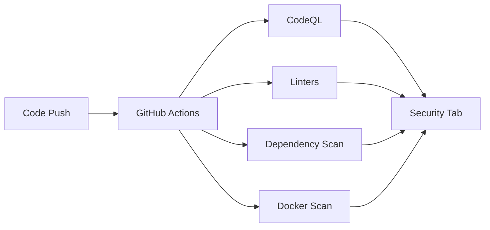

# SAST (Static Application Security Testing)

## Introduction

Le SAST analyse le **code source** sans l'exécuter pour identifier les vulnérabilités de sécurité et les mauvaises pratiques. Cette approche "shift-left" détecte les failles dès le développement.

Nous utilisons **CodeQL** (GitHub) comme outil principal, complété par des linters et scanners de dépendances.

---

## Pourquoi le SAST ?

| Aspect | Description |
|--------|-------------|
| **Détection précoce** | Trouve les failles avant la production (100x moins cher à corriger) |
| **Couverture complète** | Analyse 100% du code, y compris le code mort |
| **Automatisé** | Scans à chaque push/PR + scans hebdomadaires |
| **Standards** | Détecte OWASP Top 10, CWE |

---

## Outils déployés



### Par catégorie

| Catégorie | Outils |
|-----------|--------|
| **SAST** | CodeQL, Ruff (Python), ESLint (JS/TS), Checkstyle/PMD (Java) |
| **Dépendances** | pip-audit, npm audit, OWASP Dependency-Check |
| **Docker** | Trivy |

---

## Implémentation par application

### app-qg-api (Python/FastAPI)

| Outil | Usage |
|-------|-------|
| **CodeQL** | Analyse sémantique Python |
| **Ruff** | Linting + formatage |
| **pip-audit** | CVE dépendances Python |
| **Trivy** | Scan image Docker |

### app-qg-java-engine (Java)

| Outil | Usage |
|-------|-------|
| **CodeQL** | Analyse sémantique Java |
| **Checkstyle** | Conventions de code |
| **PMD** | Détection bugs |
| **OWASP Dependency-Check** | CVE dépendances Maven |
| **Trivy** | Scan image Docker |

### app-qg-front / app-terrain-front (Next.js)

| Outil | Usage |
|-------|-------|
| **CodeQL** | Analyse JS/TypeScript |
| **ESLint** | Linting Next.js |
| **npm audit** | CVE dépendances npm |
| **Trivy** | Scan image Docker |

---

## Déclencheurs

| Événement | Quand |
|-----------|-------|
| `push` | Push sur `main` |
| `pull_request` | PR vers `main` |
| `schedule` | Mercredi 5h UTC |
| `workflow_dispatch` | Manuel |

---

## Bonnes pratiques

### Permissions minimales

```yaml
permissions:
  contents: read
  security-events: write
```

### Format SARIF

Tous les outils exportent en **SARIF** pour intégration GitHub Security.

### Cache des dépendances

```yaml
# Python: uv avec cache
# Java: cache maven
# Node.js: cache npm
```

---

## Ressources

- [CodeQL Documentation](https://codeql.github.com/docs/)
- [GitHub Advanced Security](https://docs.github.com/en/code-security)
